# Installing SFML libraries on Windows 11 from source

## 1. Basic install
### 1.1 Installing cmake-3.23.0-rc5-windows-x86_64.msi
> Cmake_path_config.png

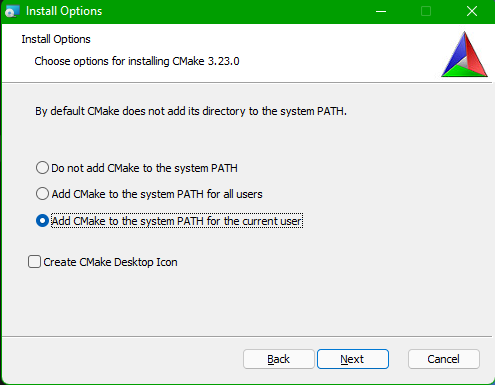
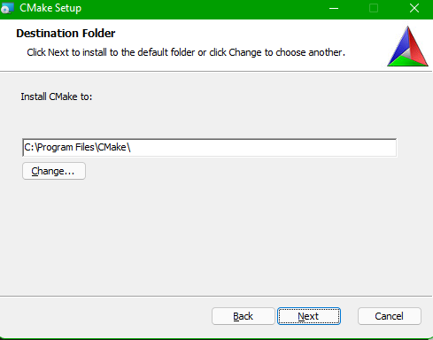

### 1.2 Installing mingw-get-setup.exe
> Recommended install MinGW files to C:\SFML directory

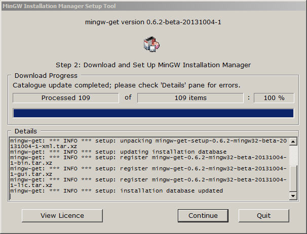
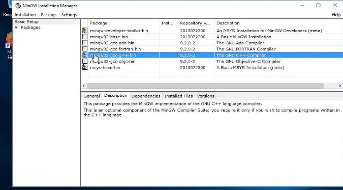

### 1.3 Setup Path variables
> Click on **properties**

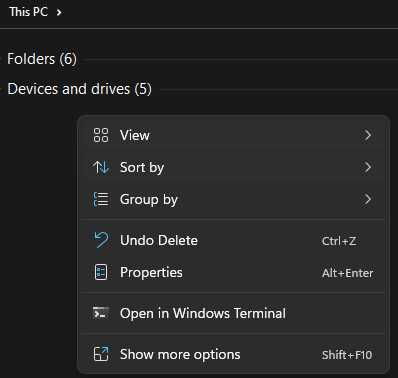

> Click on advance system settings

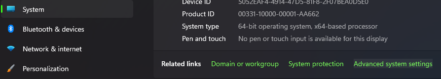

> Click on **environment variables**

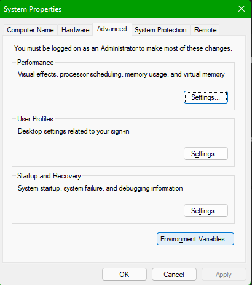

> Choose **Path** variable and click on **edit**

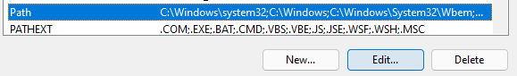

> Click on **New** button and add "C:\MinGW" ,
Then in the same way add "C:\Program Files\cmake-3.23.0-rc4-windows-x86_64"
Your system variables should look like:

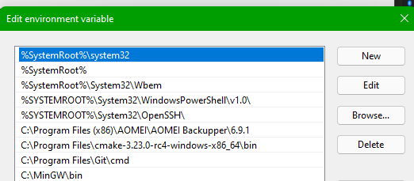

## 2. Install SFML from source
> Download SFM lib from git [repository](https://github.com/SFML/SFML/archive/refs/heads/master.zip) 

> Unzip SFML lib to convenient place like "C:\Users\YourName\Desktop\"

> You will get lib source folder "C:\Users\YourName\Desktop\SFML-2.5.1-sources"

> In "C:\Users\YourName\Desktop\SFML-2.5.1-sources" create another folder "C:\Users\YourName\Desktop\SFML-2.5.1-sources\Fresh_Build" to generate cmake files

> Run cmd from Windows11 menu

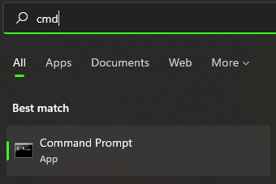

> Type cmake-gui

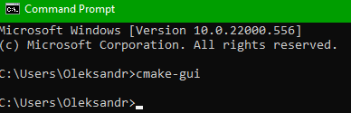

> configure cmake-gui and click "configure" 

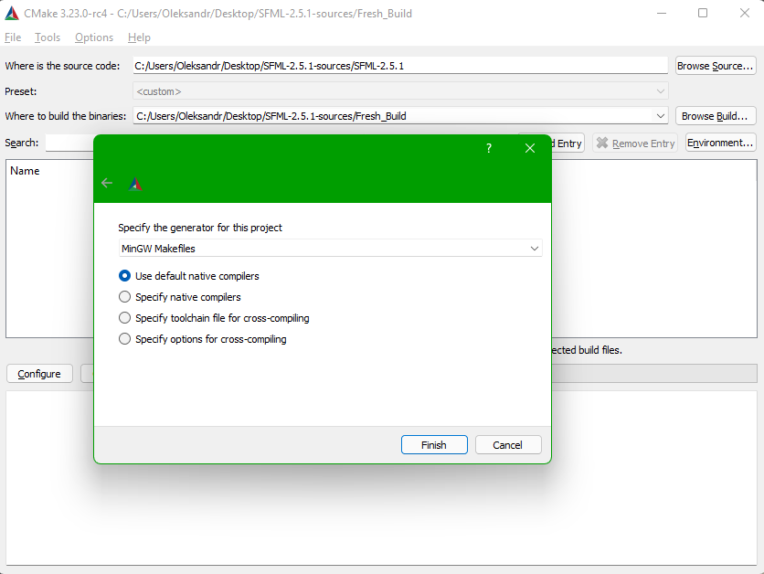

> Change CMAKE_INSTALL_PREFIX from "C:/Program Files (x86)/SFML" to "C:/SFML"

> Decide what LIBS you need if you need shared libraries BUILD_SHARED_LIBS ✅  should be on,
else SFML_USE_STATIC_STD_LIBS ✅ , but you can't choose bought

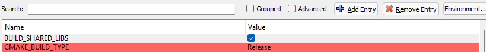

> After configuring cmake variables, click on "generate" button and wait until it complete 

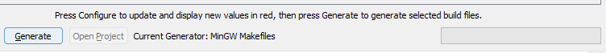

> To install all generated bin to "C/SFML" directory, open cmd and type "mingw32-make install" 

> After installing SFML you will get folder with bin folder

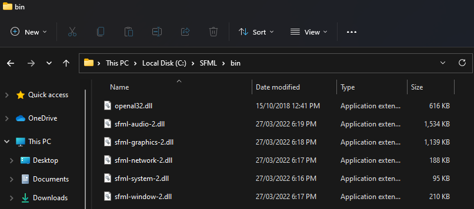

> Add "C:\SFML\bin" to Path

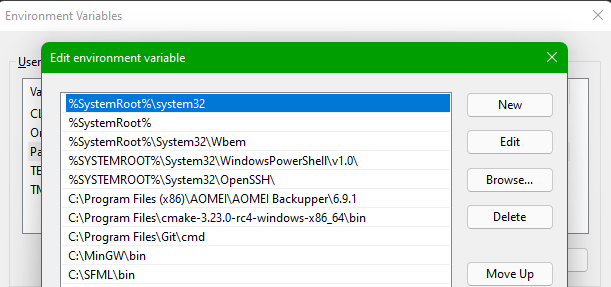

## 2. Testing
> Now you have SFML lib

> To testing whether all works fine use this Cmake. 

> Simple build project and run executable file